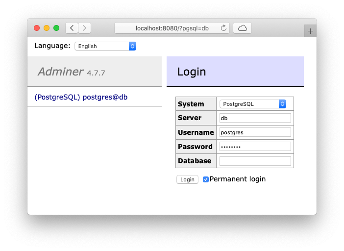
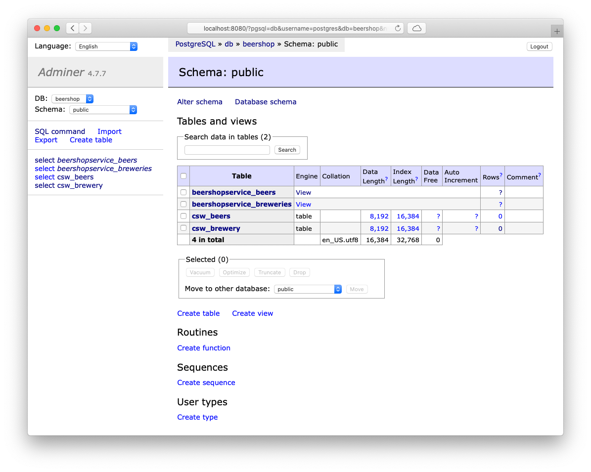

# contributing to `cds-pg`

The PostgreSQL adapter to `CAP` lives off of the effort of the community 🧍‍♀️🧍🧍‍♂️.  
Only together can we get this to a state where `cds-pg` achieves production-level quality 💪, providing a persistence option outside `sqlite` and `hana`.

## setting up the development environment

there's multiple parallel levels that we recommend to set up in order to develop further features for `cds-pg`.  
essentially, this boils down to 3 things:

- local PostgreSQL server with content
- runnable OData queries + a test environment with debug (breakpoint) capabilites
- comparison with a supported persistence driver, sepcifically `sqlite` in-memory

With the above in place, coding 👨‍💻 becomes a charm :)

### initial setup

install required node modules:

```bash
$> npm i
```

use `node` in version `lts/erbium`.  
there's a `.nvmrc` provided, so on OS's supporting this, it's a matter of

```bash
$> nvm use
```

it's not a necessity to use `Visual Studio Code` as IDE, but we strongly recommend it (b/c we use it 😆).  
If you're on a different IDE - no sweat, but we might not be able to help with e.g. debugging capabilites.

### local PostgreSQL server with content

we're providing a docker image that gets filled with content upon boot.  
in order for this to work, you need [`docker-desktop`](https://www.docker.com/products/docker-desktop) installed.  
then it's a matter of running `npm run test:pg:up-nobg` that does all the heavy lifting for you.

```bash
$> npm run test:pg:up-nobg
# ...
Creating network "cap-proj_default" with the default driver
Creating cap-proj_db_1      ... done
Creating cap-proj_adminer_1 ... done
Attaching to cap-proj_adminer_1, cap-proj_db_1
# ...
```

In addition to a standalone, pre-filled PostgreSQL server, this also gives you a web-based frontend for PostgreSQL at http://localhost:8080


Choose `PostgreSQL` as `System`,  
`Username`: `postgres`,  
`Password`: `postgres`.

Upon successful login, you'll see the `beershop` db, w00t 🍺


### runnable queries and runtime debug capabilites

`jest` is the test-runner and -framework.  
All tests are located in `__tests__`, files important for the test run-time in `__test__/__assets__`.

If the standalone `PostgreSQL` server is running as explained above, you can use regular `jest` commands and flows:

- `npm run jest` runs all tests in `__tests__`
- run a single test
  - by editing one of the test files, issuing `test.only(/*...*/)`
  - calling `npm run jest` or from the command line: `$> node_modules/.bin/jest`
- turn on `jest`'s watch mode and morph into TDD-mode: `$> node_modules/.bin/jest --watch`

#### OData queries

#### Debugging

## other thingies

- `prettier` is used for code styling, configured in `package.json` -> please adhere to the formatting rules :)
- `eslint` is is responsible for static code checks, see `.eslintrc.json`
- git commit messages are linted: they need to adhere to the "[conventional changelog](https://www.conventionalcommits.org/en/v1.0.0/)" rules that are based on the [angular commit guidelines](https://github.com/angular/angular/blob/master/CONTRIBUTING.md#commit)  
  this makes it easier for us maintaining a changelog

## Collaboration

Please provide pull requests against the `master` branch of this project.  
On every PR, the entire test suite is run against a dockerized `postgres` database, helping to prevent bugs and catch'em regressions :)  
A reviewer is required for each PR. As of now, please add either [@gregorwolf](https://github.com/gregorwolf) or [@vobu](https://github.com/vobu).  
Our hopes are high that one day, [@aragonX](https://twitter.com/aragonx) will chime in and lead all this :)
